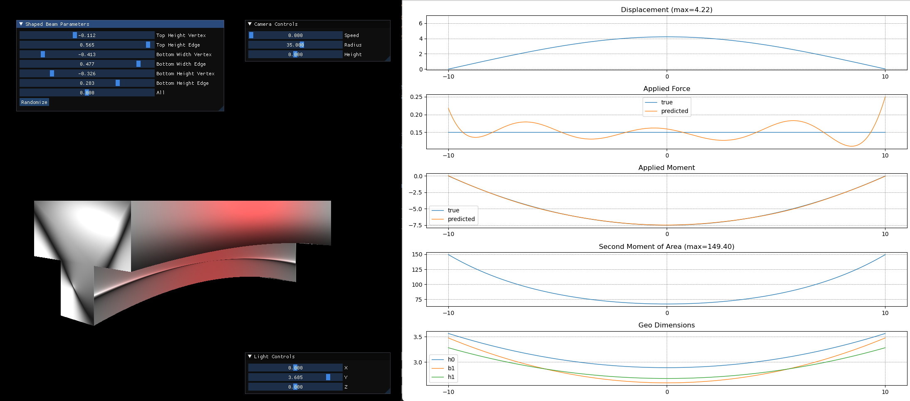

# HPC for Building Simulation

This repository has some examples for implementing numerical methods in the context of building simulation while leveraging high-performance computing resources (namely, GPUs).

It is very much in WIP state. Focus is currently on PINNs.  Work is mostly not in a modularized/library form yet.  Very much in the early experimentation/messy/rapid iteration mode at the moment.

## Physics-Informed Neural Networks

Physics-informed neural networks are a relatively new field which aims to solve PDEs by taking neural networks as a prior.  Crucially, the auto-differentiability of a neural network enables checking if the current state of the neural network satisfies the PDE by evaluating the appropriate partial derivatives at a collection of points in the domain and on the boundaries and substituting into the PDE.  By moving all terms in the PDE to one side of the equation, each sampled point yields a residual term for how close the neural network approximation is to satisfying the PDE; this residual can then be used as a loss term to be driven to zero and thus forcing the network to satisfy the PDE. For more info on PINNs, check out the original paper [here](https://www.sciencedirect.com/science/article/abs/pii/S0021999118307125) or some of the links [here](https://colab.research.google.com/drive/1jcRCk3Tpj8bGBMSuDmtd0fANlNLs_1Ay#scrollTo=fFQfGNFQxBDY).

In this `/pinn` directory of this repo, you can find some of my ongoing experiments with PINNs.  There are a few demonstrations in notebook/script form:

#### Static Euler-Bernoulli Beam Equation with Spatially Varying Geometry

rapidly expanding but also WIP. The key innovation here is that the model is solving an entire range of parameterized PDEs simultaneously, i.e. it is solving the solution for all geometric possibilities entailed by a parameterized definition of the second moment of area.  On the horizon is using B-splines to generate the geometry (T-beam sectional widths/heights) rather than quadratics before deriving the second moment of area, parameterizing the load function and/or predicting multiple load cases simultaneously, simultaneously solving multiple beam lengths (i.e. parameterizing the domain).  The ultimate goal is to use the network in a design optimization problem.

#### Harmonic Oscillator

showcases "curriculum transfer learning", where the PINN is trained on lower frequencies before being retrained on higher and higher frequencies

#### Diffusion Equation 1D

simple heat diffusion through spatially varying diffusivity fields, showcases soft-adapt weighting as well as residual-adaptive resampling.  One key insight here is that using differentiable functions for definition of the spatially varying material properties is very helpful.

#### Advection/Diffusion Equation 2D

same as above, but with constant advective velocity field enabled, variety of boundary conditions

#### Non-isothermal Incompressible Navier-Stokes

very much a work in progress.  Goal is to get a Rayleigh-Bernard Convection cell working and/or vortex shedding.

## FDM for Heat Diffusion through Solids

Currently working on accelerated Finite Difference Method (FDM) solvers for unsteady heat diffusion through spatially varying diffusivity fields using a half-interface layer for the spatially varying material properties.  

The main use-case here is for 2D analysis of thermal bridges and breaks in building details/wall constructions as well as how geometry and thermal mass can interact.

Currently experimenting with parallelized relaxation methods - NB: the relaxation code is currently incorrect with timescaling/spatial scaling issues, and development is currently paused to focus on Physics Informed Neural Networks (PINNs).

## LBM for Multiphysics: Atria & Solar Chimney Natural Ventilation

Currently working on accelerated Lattice Boltzmann Method (LBM) solvers which couple thermal fields with hydrodynamic fields for the purpose of modeling buoyancy driven natural ventilation in buildings, i.e. for solar chimneys and atria, or data centers on high floors dumping heat into a ventilation shaft.  A simple fluid solver is currently implemented, with the coupled thermal solver to be worked on in the future.

## Integration with CAD

The scripts in this repo can be connected to the Rhinoceros/Grasshopper modeling environment.  Currently, only the heat diffusion FDM script is configured.  Run `webserver.py` in `/fdm` to try it out.  Rhino and Grasshopper demo files are provided for reference.
